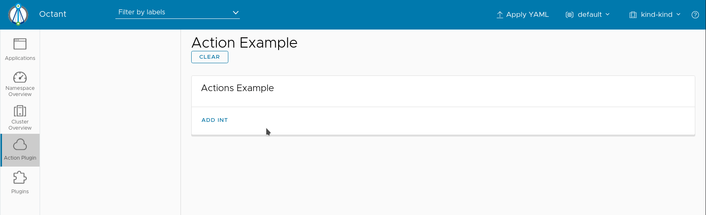

## Actions API Sample

This example shows how an action can be called to maintain state in a plugin.

Submitting a number to the form saves each subsequent entry.

## Installation

Build the plugin:

`go build`

Then move the binary:

`mv actions-api-sample $/HOME/.config/octant/plugins/`

You may need to create this directory if it does not exist.

