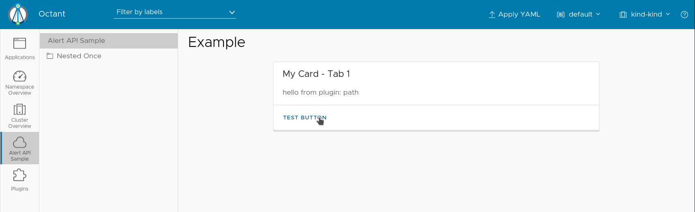

## Alert Sample

This example shows how to send an alert visible globally above the header bar.

The alert is triggered through an action and is mapped only to the Octant instance that triggered the action.

## Installation

Build the plugin:

`go build`

Then move the binary:

`mv alert-sample $/HOME/.config/octant/plugins/`

You may need to create this directory if it does not exist.

