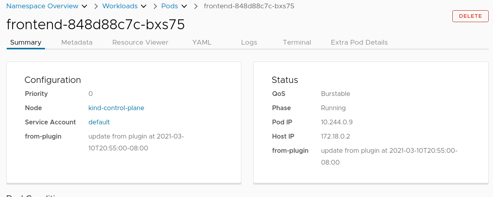

## Extend GVK Sample

This example shows how a plugin can add a tab or inject addition components for a given Kubernetes object `Kind` and `Version`.

A new tab is added as `Extra Pod Details`, additional data `from-plugin`, and a card (not shown) is added to all pods.

## Installation

Build the plugin:

`go build`

Then move the binary:

`mv extend-gvk-sample $/HOME/.config/octant/plugins/`

You may need to create this directory if it does not exist.
