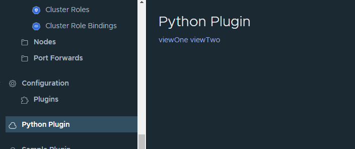

# octant-py-plugin

Example Python plugin for Octant

## Try

    python3 -m venv venv
    venv/bin/python setup.py install
    ln -s `pwd`/venv/bin/octant-py-plugin ~/.config/octant/plugins/octant-py-plugin
